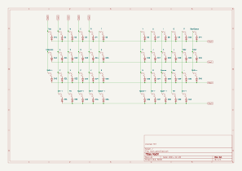
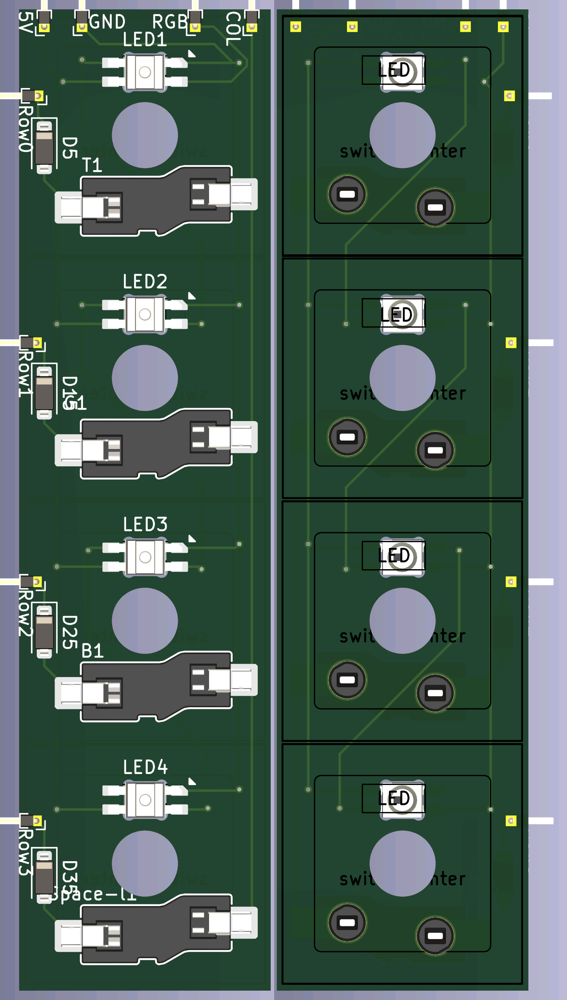

# MyCK
MyCK (My Custom Keyboard) es un proyecto cuyo objetivo es aprender a crear un teclado customizado desde cero.

La idea surge tras ver teclados como:

- [Sweep](https://github.com/davidphilipbarr/Sweep)
- [crkbd](https://github.com/kluelesskk/crkbd)
- [Dilemma](https://github.com/Bastardkb/Dilemma)
- [Voyager](https://www.zsa.io/voyager)

Estos teclados usan el proyecto [QMK](https://qmk.fm/) para la creación del firmware que es instalado en un microcontrolador.

## Objetivos

La idea es entender y crear un teclado, y para ello los pasos a seguir van a ser:

- [x] Aprender los entresijos de un teclado a nivel electrónico.
- [ ] Aprender a usar [KiCad](https://www.kicad.org/)
  - [ ] Crear esquema electrónico
  - [ ] Crear PCB
  - [ ] Mandarla crear?
- [ ] Aprender a crear un custom firmware con [QMK](https://qmk.fm/)

## Imágenes

Esquema electrónico completo de cómo sería un teclado:

Esquema de la placa de pruebas:

Sólo las pistas para la placa de pruebas:

